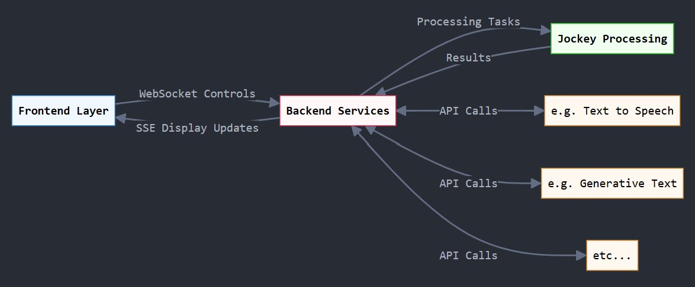

# Developer's Guide to Saddle Stack 

This is a quickstart for anyone interested in understanding or extending our project. It covers basic architectural considerations as well as some implementation specifics.  

Although we wouldn't go as far as to say this is a reference project, it is certainly a solid starting point for experimentation around a variety of Jockey-related app types that we envisioned. We aimed for a balance of simplicity with considerations for clear separation of concerns, efficient real-time communication, scalable processing capabilities, and modular integration with external services. In short, we wanted this to be accessaible enough to get up and going quickly but robust enough to give you some options for additional exploration.

You can also use this guide as a helper for llm support.

## Overview 

There are three primary components, with an option to integrate additional third-party services.



Data Flow:
 - User submits request through UI
 - Frontend sends WebSocket control requests to Backend
 - Backend delegates processing tasks to Jockey Server
 - Jockey Server returns processing results to Backend
 - Backend filters and formats responses, sends SSE display updates to Frontend
 - Frontend plays video served from remote server

Note: Backend can be used to make websocket/api/other calls to third-party services as needed

### NVIDIA AI Workbench

We set this up with our management scripts and use it to wrap the Jockey Server. The foundation provided here serves an important purpose: to abstract complexity and simplify deployments across a wide range of infrastructure, from your local workstation to clustered GPU. Frankly, it's a very cool / relatively universal way to provide simplified deployments of almost anything to anywhere. There is a curve to get there, but once it's in place being able to deploy all the things is straightforward.  

Today we are only using this for the main jockey server (still a big advantage) but we would like to explore adding the UI example in as a custom app.   

The use of compose at this level is also possible but for our use case we wanted to keep things separate until we can contribute the new compose configuration back to the Jockey project. Additionally, things get quite a bit more challenging when we want to compose from the root level but spin up multiple indepdently declared sub projects. Possible, but also seemingly defeats the purpose of custom apps. We think there are more options here but they will need to be explored more.

### Demo UI Application [code/demo-jockey-ui]


Frontend is Primary interface for user interactions
 - Manages video player and state
 - Communicates with backend via WebSocket controls
 - Receives display updates through Server-Sent Events (SSE)


Backend Services maintain connections with external services
 - Bi-directional API or WebSocket communication options
 - Separate from the main processing flow
 - Handles all WebSocket and SSE communication with frontend
 - Coordinates video processing tasks with Jockey Server
 - Integrates with third-party services via API calls
 - Manages configuration and state

`code/demo-jockey-ui` has a fully functional and extensible  app that you can use to create your own brand new video from your existing content. This demo is primarily in place to showcase how to leverage the use of an agentic server like this, but it is starting point that you can use to include additional services.

### Twelve Labs "Jockey" service [code/jockey-server]


 - Powers the core video processing functionality
 - Contains LangGraph Engine for workflow management
 - Maintains worker pool for task execution
 - Provides specialized tools for:
  - Video search capabilities
  - Video editing functions
  - Text generation features

## Communication Patterns

### WebSocket Integration
- Real-time bidirectional communication
- Best for: Control, Live updates, streaming data
- Implementation pattern:
  ```python
  async def websocket_endpoint(websocket: WebSocket):
      await manager.connect(websocket)
      try:
          while True:
              data = await websocket.receive_json()
              # Process and respond
      except WebSocketDisconnect:
          await manager.disconnect(websocket)
  ```

### Server-Sent Events (SSE)
- One-way server-to-client updates
- Best for: Status updates, progress monitoring
- Implementation pattern:
  ```python
  async def sse_endpoint():
      async def event_generator():
          while True:
              if await request.is_disconnected():
                  break
              yield f"data: {json.dumps(update)}\n\n"
      return EventSourceResponse(event_generator())
  ```

### REST API Extension
- Traditional request-response
- Best for: CRUD operations, stateless interactions
- Implementation pattern:
  ```python
  @router.post("/api/new_service")
  async def new_service_endpoint(data: ServiceModel):
      result = await process_service(data)
      return ServiceResponse(result=result)
  ```

## Adding New Services

1. Create Service Module
   ```
   services/
   ├── base_service.py
   └── new_service/
       ├── __init__.py
       ├── models.py
       ├── router.py
       └── service.py
   ```

2. Define Service Interface
   ```python
   class NewService(BaseService):
       async def initialize(self):
           # Setup code
       
       async def process(self, data):
           # Processing logic
   ```

3. Add API Endpoints
   ```python
   router = APIRouter(prefix="/api/new_service")
   
   @router.post("/")
   async def handle_request(data: ServiceModel):
       return await service.process(data)
   ```

4. Register Service
   ```python
   app.include_router(new_service.router)
   app.state.new_service = NewService()
   ```

## Frontend Integration

1. Add Service API Client
   ```typescript
   class NewServiceAPI {
     async connect() {
       // Setup connection
     }
     
     async process(data: ServiceData) {
       // Process request
     }
   }
   ```

2. Create UI Components
   ```typescript
   const NewServiceComponent: React.FC = () => {
     // Component logic
   }
   ```

3. Add State Management
   ```typescript
   interface ServiceState {
     // State definition
   }
   ```

## Testing New Services

1. Unit Tests
   ```python
   def test_service_processing():
       result = await service.process(test_data)
       assert result.status == "success"
   ```

2. Integration Tests
   ```python
   async def test_service_api():
       response = await client.post("/api/new_service", json=test_data)
       assert response.status_code == 200
   ```

## Deployment Considerations

1. Environment Configuration
   ```bash
   NEW_SERVICE_API_KEY=xxx
   NEW_SERVICE_ENDPOINT=https://api.example.com
   ```

2. Docker Integration
   ```dockerfile
   FROM nvidia/cuda:11.8.0-base-ubuntu22.04
   # Service setup
   ```

3. Resource Requirements
   - CPU/GPU requirements
   - Memory considerations
   - Network bandwidth

## Best Practices

1. Error Handling
   ```python
   try:
       result = await service.process(data)
   except ServiceException as e:
       logger.error(f"Service error: {e}")
       raise HTTPException(status_code=500, detail=str(e))
   ```

2. Logging
   ```python
   logger.info(f"Processing service request: {request_id}")
   ```

3. Performance Monitoring
   ```python
   @metrics.timer("service_processing_time")
   async def process(self, data):
       # Processing logic
   ```
   
## Dependency Management 

We wanted a robust dependency management approach that ensures the developer experience does not change over time or on different hardware. Here's an overview of how it works, with more details below:


### Main Project Dependencies
`.project/spec.yaml` identifies all general project dependencies, and there are additional details in the `preBuild` and `postBuild` scripts.  The NVIDIA AI Workbench process manages all of this.  More info is available [here](https://docs.nvidia.com/ai-workbench/user-guide/latest/projects/projects.html#default-ai-workbench-project-structure) and [here](https://docs.nvidia.com/ai-workbench/user-guide/latest/projects/spec.html#projects-spec).

### Demo UI Dependencies
**yarn** generates `yarn.lock` from package.json  
**conda-lock -f environment.yml -p linux-64 -p osx-64 -p win-64** generates `conda-lock.yml` from environment.yml   
Both are referenced by `scripts/dev.sh` at runtime.  

Before generating a new conda lock, execute `conda deactivate; conda env remove -n jockey-ui`. The next time you run the app the environment will be recreated with the latest changes.  

### Jockey Server Dependencies
**pip-compile requirements.txt --output-file requirements.lock --verbose** generates `requirements.lock` (replaces requirements.txt)  
This is referenced in `app.sh` at runtime

 