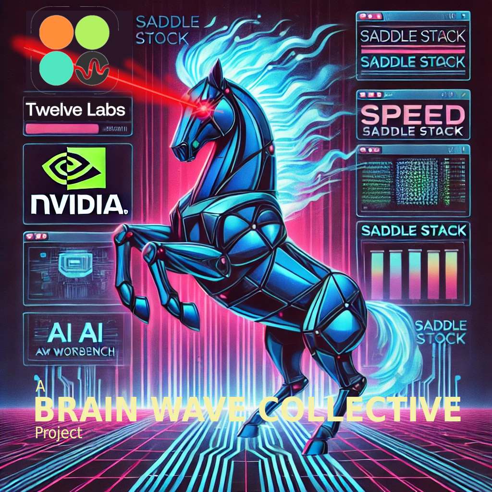

# Welcome to Saddle Stack!

 
 The goal of this project is to provide you with a fast and easy way to get started in the world of modern AI app development. We massively simplfy some heavy lifing and we cover a lot of ground here: 
 - Setup and prepare cloud hardware
 - Install and configure NVIDIA AI Workbench server
 - Deploy a remote [Jockey](https://www.twelvelabs.io/blog/introducing-jockey) agentic video server
 - Provide a full stack UI that allows you to generate new videos from your own [TwelveLabs](https://www.twelvelabs.io/) content
 - Additional supporting info and documentation for extending in our [Development Guide](DEVELOPMENT_GUIDE.md)

We expect that you will take your time to understand what is involved, and setting up pre-requisites could take time (maybe a half hour or so), but when it comes to the technical heavy lifting everything is taken care of for you. The heavy duty stuff is fast fast fast; **it takes about 6 minutes to do all of the things**, including configuring your remote server, installing AI Workbench and setting up the project, spinning a Jockey server, and firing up your own UI. With prereqs in place it's possible for you to create your first video in less than 10 minutes.  

However, this project isn't really about generating new videos, it's about giving you a starting point for working with heavyweight hardware and modern approaches to applications, deployments, and managing AI/ML workloads. We hope this project will be a transition point for your introduction to the space, and can serve as a jumping off point for you to explore related aspects.  

***This project was inspired by "Saddle Stack (AKA Jockbench)" the [Brain Wave Collective](https://brainwavecollective.ai)'s winning submission to [NVIDIA's HackAI Challenge](https://www.nvidia.com/en-us/deep-learning-ai/solutions/data-science/workbench/). Contact [Daniel](mailto:daniel@brainwavecollective.ai) for any needs***

## Overview 
This README will walk you through everything you need to get started.  Below is the general layout of this repository.  

This repo greatly simplifies some serious tooling. Although the primary aspect showcased by our project is how incredibly approachable it is to utilize heavy duty Cloud GPU to deploy a fully functional server through Workbench, our approach provides a variety of novel solutions including:
 - Walkthrough of steps to setup a powerful remote GPU server (it's super easy for this use case)
 - A new one-click installation of your remote's NVIDIA AI Workbench (much easier that the official guide)
 - Our own fully automated configuration of your remote AI Workbench environment (so much abstraction!)

  
** NOTICE: The code provided here are for use with experimental development instances. For many reasons, this should not be used in production without modifications necessary to support such a use. **  

### General NVIDIA AI Workbench
Under `.project` and in the root directory you will find the standard project-specifc configuration. The details of this README also cover basic setup of your local NVIDIA AI Workbench client. We tried to keep this as minimal as possible, because the biggest benefit of Workbench is when you are relatively unaware that it is being used.  

### Bonus NVIDIA AI Workbench Utilities 
`code/utils` has utilities that we created to dramatically simplify installation and configuration of a remote GPU server. Our opinionated and comprehensive approach means you only need to setup your PreRequisites and run a script. Interactions and touchpoints are minimal, and all of the heavy lifting is taken care of for you.  These details are covered under the 'Remote Server Setup' section below.  

### Twelve Labs "Jockey" service 
This is the primary focus of this project. `code/jockey-server` has a comprehensive and fully wrapped multi-agent video production framework and deployable server . This was not as simple as a direct port; Jockey is an extremely early offering and we now believe this project to be a first-ever fully deployable Jockey server, which also includes a static file server so you can now run this anywhere.  

Through NVIDIA's AI Workbench anyone will be able to access this server extremely quickly and easily, making it easier to extend and build this incredible open source offering. We are in discussions with the maintainers to determine how to best submit our contributions back to the community.  

### Demo UI Application
`code/demo-jockey-ui` has a fully functional and extensible reference app that you can use to create your own brand new video from your existing content. It is also a fairly comprehensive starting point that you can use to include additional services.

# PreRequisites 
Before you run this framework you will need to navigate to external sources and setup a few pre-requisites. Although Jockey does support other providers, and we have talked about to expanding the offering to include more, we will focus on a specific workflow for the hackathon.  

Because the agent will be handling nearly everything for you, there's not much else to do other than provide your videos and setup the related API Keys. 

### TwelveLabs Account with an API Key (free, limited use)
It is easy and free to get started with the [TwelveLabs](https://www.twelvelabs.io/) API. Once you have created an account, you can [manage your TwelveLabs API Keys in your Dashboard](https://playground.twelvelabs.io/dashboard/api-key).

** NOTICE: You cannot use the provided sample indexes and you will need to [upload your own videos](https://docs.twelvelabs.io/docs/playground-upload-manage-videos). ** 
The free account includes 10 hours of video, and it only takes a few minutes to index them. The sample indexes are not available through the API, so if you try to access them you will recieve an error that says INDEX ID NOT FOUND.

Once you have uploaded your own videos you will need to identify the associated Index ID:
 - Navigate to the [TwelveLabs Index Page](https://playground.twelvelabs.io/indexes)
 - Select the tab for `My Videos`
 - Click on the index you would like to explore 
 - Note the Index ID, which is also in the URL of the index (e.g., `https://playground.twelvelabs.io/indexes/<YOUR-INDEX-ID>`)  

** WARNING: Do not use private videos with our project! **  
Although Twelve Labs itself is secure and their terms and conditions will apply for videos that you upload, videos created with our experimental development service are technically exposed to the public. The risk of exposure is low; even if someone could find your endpoint, we have disabled directory listing of the nginx server, and it is unlikely that someone would have a desire or ability to guess your Index ID and video names. In any case, we think it is wise to communicate that we do not recommend experimenting with indexes that include videos which are private or senstive.
 
### OpenAI Account with an API Key (paid)
You will need an [OpenAI account that has API access](https://openai.com/api/). This is not the same as the $20/month ChatGPT subscription. API fees are charged per use and are relatively inexpensive; for example running this to create a video may cost a few cents.  

Once you have established billing for your OpenAI account, you can create a service account key on the [Project API Key Page](https://platform.openai.com/api-keys).  

### Langsmith Account with an API Key (free)
This is necessary for tracing your server activity. Navigate to [Langsmith](https://smith.langchain.com/) and create a free account.

Once your account is created, select "Settings" and then "API Keys" to create a new API key.  The URL will look like `https://smith.langchain.com/o/<your-uid>/settings`

### GitHub PAT 
This process will require that you have a GitHub Personal Access Token in place on your GitHub account. We recommend a classic token w/repo scope.

### GPU Cloud Provider Account

Although AI Workbench is designed to give you access across any provider, and there are a number of ways to source GPU, we recommend creating an account with [Shadeform](https://www.shadeform.ai/?ref=brainwavecollective). 

We like Shadeform because you can manage access to multiple providers through one account. The pricing is the same as if you were going direct, and they provide a unified API to manage your instances. This gives you access to a larger number of GPU through a single, simplified interface. With Shadeform we can just choose the least expensive of whatever is available that meets our needs, and we don't have to keep track of multiple accounts across multiple providers. 

That said, you will be able to deploy AI Workbench anywhere so long as the provider does not give access through a restricted container. Below are some of the providers that we confirmed to be successful through Shadeform (Note that this is definitely NOT a complete list, but these are ones where we have explicitly confirmed success with this project):  

| Shadeform Provider | Status |
|----------|--------|
| DataCrunch | ✅ |
| Hyperstack | ✅ |
| IMWT | ✅ |
| MassedCompute | ✅ |
| Oblivus | ✅ |
| Valdi | ✅ |

### SSH keys to Access your Server
Although you could use one key, or even re-use an existing key, these practices are generally not recommended. Because of this we're going to use two separate SSH keys to manage two separate connections.  That said, this isn't going to be a security lesson, so if you are new to using SSH keys it is HIGHLY RECOMMENDED that you take some time to familairize yourself with security best practices. In any case, for our process you will need two pairs of public/private keys.  
 
#### SSH Key #1: Connecting directly to the Instance 
Your first key will be used to connect from your local workstation to your remote GPU server.
While some GPU services provide default keys, we recommend creating a new key for this specific purpose:  
`ssh-keygen -t ed25519 -C "NVWB-Server-Key" -f ~/.ssh/<server-ssh-keyname>`   

If you are unsure of what to name this key, we recommend `nvwb-server-key`  

Note that this command will create two files:  
<server-ssh-keyname> (private key)  
<server-ssh-keyname>.pub (public key)  

#### SSK Key #2: Connecting to the NVIDIA AI Workbench server 
Your second key will be configured for NVIDIA's AI Workbench to connect from your local workbench client to your remote workbench server. We recommend creating a new key for this specific purpose:  
`ssh-keygen -t ed25519 -C "NVWB-User-Key" -f ~/.ssh/<workbench-ssh-keyname>`   

If you are unsure of what to name this key, we recommend `nvwb-user-key`  

Note that this command will create two files:   
<workbench-ssh-keyname> (private key)  
<workbench-ssh-keyname>.pub (public key)  

### Save your variables: 
At this point you will have established the following: 
 - [ ] TwelveLabs API Key
 - [ ] TwelveLabs Video Index ID
 - [ ] OpenAI API Key
 - [ ] Langsmith API Key 
 - [ ] Weave API Key (Optional for UI)
 - [ ] Remote Server IP (or hostname)
 - [ ] SSH key for connecting directly to your remote server (Server Key)
 - [ ] SSH key to connect to your local NVIDIA AI Workbench to your remote (User Key) 
 - [ ] GitHub PAT 
 
Copy the `.env.example` file and rename it to `.env`. Update the values that correspond to the above.  

Note that our approach to this project is that your will simply include all of your configuration in the root `.env` and we will automatically propagage that to all of the appropriate places (the server, the app, and your remote Workbench instance).  

# Local Workstation Setup  
This tutorial requires you to [install the NVIDIA AI Workbench client](https://docs.nvidia.com/ai-workbench/user-guide/latest/installation/overview.html), in a location such as your laptop.  Installation is fairly straightforward so long as you meed the minimum requirements. Note that while you may feel free to use the service however you like, AI/ML related activities tend to be fairly demanding. Additionally, containerization can be a lot to manage in the long term and can consume a large amount of disk. As a result, as a general pattern we recommend limiting your local use and performing all activity on a remote host.  

Past the basic installation, you won't need to prepare anything specific for this project.  

# Setup Remote Server and Run Jockey
AI Workbench makes it easy to setup a remote, and it is relatively cheap and easy to create your own cloud GPU server from one of many providers. Follow the below steps to simplify the process even more; this whole process will take 10-15 minutes and most of that time is waiting.

## Create the Remote Server 
There are many cloud GPU providers available, and many that will work for this purpose, but we recommend [Shadeform](https://www.shadeform.ai/?ref=brainwavecollective). Not only do they give you access to multiple providers with one account, they wrap the access in a way that standarizes your interaction with those servers.

In any case, you're going to need to record the Server IP address. 

## Setup the Remote Server

### STEP 1 - Run our remote configuration script 
`./code/utils/configure_remote.sh` (execute permissions may be required)  

NOTE: This script runs in 3 sections, with a requirement for you to intervene during execution.

1. FIRST, the script will perform some automatic setup, installation, and configuration of your remote instance
2. SECOND, you will need to manually "add the remote" to the local instance and clone the GitHub project in your remote. All of the details that you need will be output in the script. You do not need to stop execution; You can perform the requested updates and then continue. If the execution is interrupted you can restart the process and it will skip the initial installation and jump ahead to the next step. This ability  to restart is also helpful if your remote project gets corrupted and needs to be deleted and recreated (say if you encounter the dreaded *git pull of death*).
3. THIRD, the script will set the values of secrets, variables, and mounts to complete the final update of your remote environment.

There are a lot of things that the script is actually doing:
 - Pulls the latest installation script from this repository
 - Loads your configuration variables
 - Confirms the presence of required environment variables and SSH keys
 - Creates a new "nvwb" user with appropriate configurations for the server
 - Establishes access to Workbench user using provided key
 - Downloads and installs the NVIDIA AI Workbench on the remote server
 - Pauses for you to configure connectivity between your client and new server (instructions provided)
 - Finishes configuring your NVIDIA AI Workbench environment with all necessary mounts, secrets, and envrionment variables 
 - Restarts your container (if finished building) which is then available for immediate use
 
### STEP 2 - Start the Jockey Agent 

We wrapped the Jockey agent into a custom AI Workbench application, simplified the instalation, and made it easy to run. Navigate to the Apps section (either through the dropdown at the top or Environment > Apps) and toggle `jockey-server` to start the agentic video server.

The service will start after a few minutes, and will be available to you at `<SERVER_IP>:8123`  
NOTE: If the service is healthy and it's not available right away, just give it a couple minutes to fully start up and try again.

To stop, scroll down to 'jockey-server' in the Environment > Apps section and toggle it off.

Note that we have an open issue to explore why the startup command fails before the timeout. Due to this, you may not be able to stop the composed stack through the UI. Instead ssh to the instance and: `docker compose down jockey-server` or `docker stop jockey-server-langgraph-api-1 jockey-server-langgraph-postgres-1 jockey-server-langgraph-redis-1 jockey-server-static-server-1`. You can also access the instance through the terminal provided in JupyterLab (just toggle the app and a local browswer will open for you).

### STEP 3 - Go have fun!
Yes it's that easy. Now that you're up and running, it's time to explore the Jockey agentic video framework. You can do that with our demo app or build your own.

## Explore the Jockey Service through our sample application 
Although this project exists primarily to showcase how easy it would be to spin up a production level service that could support heavy duty workloads on a remote instance, we know it is more interesting to see how this type of thing can work with an application that you can actually access.  

We have included our extensible full stack demo front end for your use. It provides a framework that you can use to experiment and add additional services. You only need to install conda/conda-lock and run a script to experience the app in your development environent. Note that our app only provides a one-shot request, but the connection with the Jockey Server through the websocket can be used to provide ongoing interactions (e.g., remove a scene, add a scene, shorten a video, etc.).

All of the information you need is in our [Jockey UI Demo README](code/demo-jockey-ui/README.md).

## Additional Info

### Example Future Design
Although we were only able to do so much for the hackathon, we set our sights high and imagined what an ideal solution might look like. You can [see our vision for a more complete Jockey application in this video](https://www.youtube.com/watch?v=tTFLDNxaMpU). NVIDIA's AI Workbench greatly simplifies what is necessary to power Jockey's agentic video server, allowing us to focus on novel front end functionality. Thanks to [Daniel Talavera](https://www.talacreator.com/) for helping us envision this user experience.

### Twelve Labs Resources 
[Twelve Labs](https://www.twelvelabs.io/)
[Jockey on GitHub](https://github.com/twelvelabs-io/tl-jockey)

### NVIDIA AI Workbench Resources 
[Overview of project structure and related files](https://docs.nvidia.com/ai-workbench/user-guide/latest/projects/projects.html)
[Using Git in Workbench](https://docs.nvidia.com/ai-workbench/user-guide/latest/git/git.html#git-overview)
[Info about .project/spec.yaml](https://docs.nvidia.com/ai-workbench/user-guide/latest/projects/spec.html#projects-spec)

# Project Team 
[Thienthanh Trinh](https://www.linkedin.com/in/thienthanh-trinh-71478bb0/)  
[Daniel Ritchie](https://www.linkedin.com/in/danielritchie123/)  

