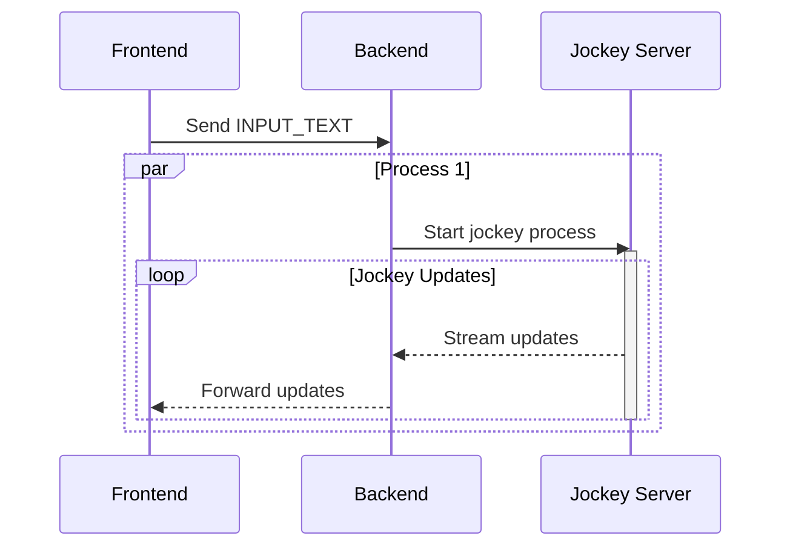

# Jockey Full Stack Front End 

A full-stack application demonstrating real-time video generation with Jockey. Featuring WebSocket control and SSE communication, with a React frontend. This also serves as an extensible baseline that would support a variety of additional extensions.  

TBD: include app diagram (from root of this repo) and describe ways this could work.

## Architecture Overview



### Key Components


React front end, with a FastAPI backend that handles all of the API calls to the various services, including the Video Agent/Jockey. A Websocket manager is used for control along with SSE to provide streaming updates back to the front end.

- **Frontend**: React application with real-time audio/video processing
- **Backend**: FastAPI server handling API requests and WebSocket connections
- **Services**: Integrations with Jockey(Agentic Video)
- **WebSocket**: Real-time communication for audio streaming and status updates

## Directory Structure

```
app/
├── api/              # API endpoints
├── core/             # Core configuration and utilities
├── services/         # Service integrations
├── static/          # Frontend assets and React components
│   ├── assets/      # Static assets (audio, images, video)
│   └── js/          # React components and hooks
├── main.py          # Application entry point
└── schemas/         # Pydantic models

scripts/             # Development and deployment scripts
tests/              # Test suite
```

# Prerequisites

- A [Jockey Server](https://github.com/brainwavecollective/nvwb-tl-jockey/)
- [Weights and Biases API Key](https://wandb.ai/authorize) for observability ([email us](mailto:daniel@brainwavecollective.ai) to be added to our account)
- [Conda](https://docs.conda.io/)
- `conda install conda-lock` 
- [Yarn](https://yarnpkg.com/getting-started/install) 

# Development

After you complete the prerequsites and clone the repository, you can run this script to start the development server:
```bash
./scripts/dev.sh
```

## Update environment
Use this if you need to add or modify dependencies to your environment.yml  
`./scripts/update_env.sh`

This will rebuild and update your conda environment. Note that you will need to execute the conda-lock command to update the conda lock file if you want your requirements to persist in the branch.

## Check environment
Optional to make sure you've done everything correctly
`python scripts/check_environment.py`


## Production Deployment

1. Build production artifact:
```bash
./scripts/build.sh
```

2. Deploy to production:
```bash
./scripts/deploy.sh
```

The build process creates a self-contained distribution in `./dist` with all necessary files.	

# API Documentation

### Text Processing Endpoints

#### POST `/api/process/init`
Initialize a new processing thread.

**Response:**
```json
{
    "thread_id": "string",
    "status": "initialized"
}
```

#### POST `/api/process`
Process text video generation.

**Request:**
```json
{
    "text": "string",
    "thread_id": "string"
}
```

**Response:**
```json
{
    "operation_id": "string",
    "status": "string",
    "audio_urls": {
        "main": "string"
    },
    "timeline": {
        "start_time": "string",
        "end_time": "string"
    },
    "stats": {
        "chunk_count": 0,
        "total_bytes": 0,
        "chunks_streamed": 0,
        "streaming_enabled": false
    },
    "response": {
        "original_text": "string",
        "transformed_text": "string",
        "thread_id": "string",
        "audio_url": "string"
    }
}
```

### WebSocket Endpoints

#### `/api/ws/audio/{thread_id}`
Audio streaming WebSocket connection.

**Events:**
- Binary audio chunks
- Status updates (JSON)
- Error messages (JSON)

#### `/api/stream?thread_id={thread_id}`
SSE endpoint for streaming updates.

**Events:**
- `message`: Processing updates
- `ping`: Keep-alive
- `error`: Error notifications
	
	
This project was put together under the [Brain Wave Collective](https://brainwavecollective.ai/) for the NVIDIA/Dell hackathon. 

# Misc.

## Contributing

1. Fork the repository
2. Create a feature branch
3. Make your changes
4. Run tests: `pytest`
5. Submit a pull request

## License

MIT License - see LICENSE.md

## Team 
[Thienthanh Trinh](https://www.linkedin.com/in/thienthanh-trinh-71478bb0/)  
[Daniel Ritchie](https://www.linkedin.com/in/danielritchie123/)  


